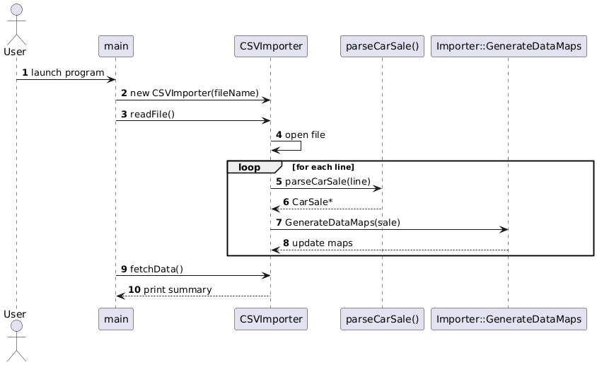

# Case Study — Car Sales Data Importer \& Query Processor

# BLOT
- **Build** with CMAKE and VisualStudio 2022 **OR** MinGW (Windows)
    -   OR **download pre-built binaries** in binaries/win64/*
- **Run** command (on cmd/powershell):
    - EigenRisk_CaseStudy.exe "C:\$user\data\file.csv"
- **Run queries** - Follow instructions on the prompt window

# Table of Contents
- [Overview](#overview) 
- [Project Structure](#project-structure)
- [Build Instructions](#building-the-project)
    - [Requirements](#1-requirements)
    - [Build dir](#2-create-a-build-directory)
    - [Configure CMAKE](#3-configure-cmake)
    - [Build](#4-build-with-cmake)
    - [Application Binary](#5-application-exe)
- [Run application](#run-the-application)
    - [Run Options](#input-options)
    - [Example](#example)
    - [Run query](#run-queries)
- [Class Diagrams](#diagrams)

## Overview
**This project is a C++20 application that loads a large global car-sales dataset (CSV format) and allows the user to query information such as:**

    - Number of cars sold by a specific model/brand in a given country and year
    - Total revenue generated by a brand in a given year
    - Country-wise distribution of sales/revenue
    - Additional queries implemented in `QueryProcessor`

---

### 📁Project Structure

    ├── EigenRisk_CaseStudy             # Source Code dir
        └── CMakeLists.txt
        └── EigenRisk_CaseStudy.cpp     # main entry point
        └── Importer.cpp/.hpp           # Abstract Base class for importing
        └── CSVImporter.cpp/            # CSV-specific import logic
        └── Validator.cpp/.hpp          # validates input CSV file 
        └── CarSale.cpp/.hpp            # data model representing each car record
        └── QueryProcessor.cpp/.hpp     # processes sales & revenue queries
        └── HashUtils.hpp               # template hash function for map keys

    ├── docs                            # Doc dir
        └── UML_ClassDiagrams.png
        └── ParseCSV_SeqDiag.png
        └── QueryProcessor_SeqDiag.png

    ├── binaries                        # Prebuild binaries (Windows)
        └── win64
            └── Debug
                └── EigenRisk_CaseStudy.exe
                └── EigenRisk_CaseStudy.pdb
            └── Release
                └── EigenRisk_CaseStudy.exe
                
    ├──README.md

---

## 🛠️Building the Project

### 1. Requirements 
    - Visual Studio 2022 or MinGW
    - CMAKE (version 3.8 or higher)
### 2. Create a build directory
    - open terminal
    - cd to to project directory
    - mkdir build && cd build

### 3. Configure cmake
    cmake .. -G "Visual Studio 17 2022"

**OR**

    cmake .. -G "MinGW Makefiles"

### 4. Build with cmake

    cmake --build . --config Debug

***OR**

    cmake --build . --config Release

### 5. Application Exe
    EigenRisk_CaseStudy.exe - After successful build, should be in Debug/Release folder 
**OR**

    Use pre-built binaries in 
        binaries/win64/Debug/*
        binaries/win64/Release/*

## Run the application
    - open terminal
    - cd to EigenRisk_CaseStudy.exe location on your drive
    - EigenRisk_CaseStudy.exe "file.csv" (Check Example section below)

### Input Options
    InputFile.csv           # Input CSV File (full/relative path)
    -d, --debug, DEBUG=1    # (optional) Enable **Debug mode**
    --help, -h              # show help text
### Example:
    EigenRisk_CaseStudy.exe file.csv
    EigenRisk_CaseStudy.exe "C:\$user\data\file.csv"
    EigenRisk_CaseStudy.exe "C:\$user\data\file.csv" --debug
    EigenRisk_CaseStudy.exe "C:\$user\data\file.csv" DEBUG=1
    EigenRisk_CaseStudy.exe -h

### Run queries
    - Follow instructions on the prompt window to run pre-defined queries
    - Make sure to follow the specific format as mentioned in the prompt

## Diagrams

### UML Diagrams

### Sequence Diagram
#### CSV Parser

#### Query Processor

## TODO
- Unit tests to validate the functional code.

## Future Enhancements
#### Custom Query 
- Accept any custom user query input (like SQL).
#### Support for multiple formats
- Add support for multiple file formats (.txt, .log,, .xls etc.)
#### MFC Application
- Create a MFC app to import, visualize and generate reports from the data.